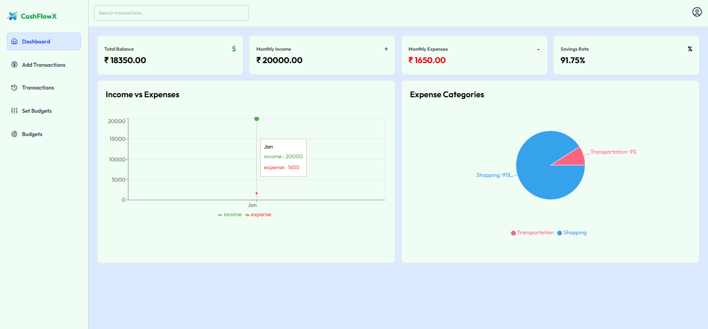
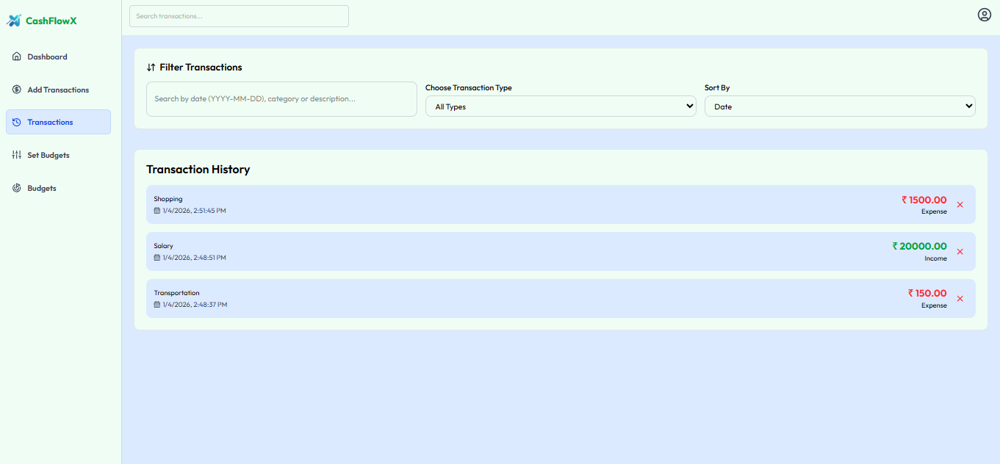
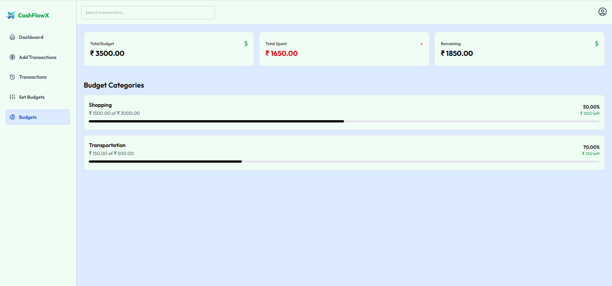

# 💰 Finance Management Web Application

A full-stack finance management web application that allows users to add, track, and manage their income and expenses while monitoring budgets through an interactive dashboard with real-time data visualization.

## 🚀 Features

- Add, edit, and delete financial transactions
- Track 100+ transactions with budget limits
- Transaction history with filters
- Responsive design for all devices

## 🛠 Tech Stack

**Frontend**
- React.js
- Chart.js
- TailwindCSS

**Backend**
- Node.js
- Express.js
- MongoDB

**Tools**
- Postman (API testing)

## 📸 Screenshots  

### Dashboard Overview

### Transaction Management

### Budget Management

## 🧠 How It Works

1. After login, the dashboard fetches summary data from MongoDB through the Node/Express backend and displays it using React.
2. Top cards show total balance, monthly income, expenses, and savings rate calculated on the backend.
3. Users add income or expense transactions, which are stored in MongoDB with amount, category, and date.
4. Transactions and budgets are retrieved to track spending and compare it with set limits.
5. The income vs expense chart shows a monthly comparison of earnings and spending.
6. Expenses are grouped by category and shown in a pie chart for clear insights.
7. New transactions update the database and refresh the UI instantly without reloading.
